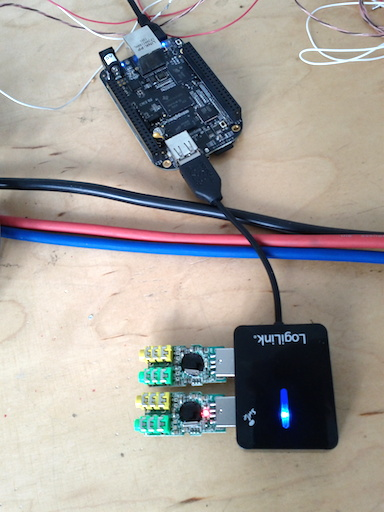

140710
======

_own projects_

multiple channels:
--
to get two channel input sound from the cheap soundcards that we are using, you can connect a usb hub and use two soundcards.  it is a bit of a hack, but it seems to work.

* `sudo jackd -P75 -dalsa -dhw:1,0 -p1024 -n3 -s &` # start jack like normal
* `sudo alsa_in -jusb2 -dhw:2,0 -p1024 -n3 -c1 &` # access the second usb soundcard
* `sudo sclang`
* `> s.boot`
* `> "jack_connect SuperCollider:in_2 usb2:capture_1 &".unixCmd`

and now you should be able to get two audio inputs.  test it like this...

```supercollider
a= {SoundIn.ar([0, 1])}.play //play mic input from two soundcards in left and right speaker
```


